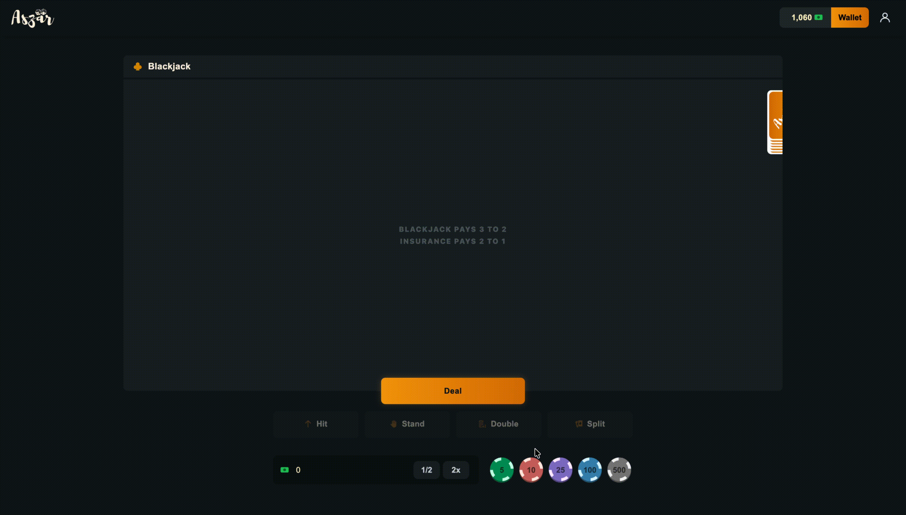

<div align="center">

# Aszar

**A real-time interactive game platform built with server-authoritative logic**


[**Live Website**](https://aszar.com) / [Features](#features) / [Architecture](#architecture) / [Getting Started](#getting-started)

</div>

## Overview

Aszar is an interactive web-based gaming platform built with Node.js, JavaScript, HTML, and CSS. The project focuses on real-time user interactions, backend-controlled game logic, and secure client-server communication.

Instead of allowing the browser to control results, Aszar uses a server-authoritative model where user actions are sent to the backend, validated, processed, and returned to the frontend. This makes the project a strong demonstration of backend logic, state management, validation, and interactive web application design.



## Interactive Modules

<div align="center">

| Blackjack | Baccarat | Roulette |
|---|---|---|
| Turn-based card logic | Outcome-based decision flow | Number and range-based interaction system |

</div>

Each module is designed around structured rules, user decisions, and backend-controlled outcomes. The frontend handles the interface and user experience, while the server manages the logic, validation, and result generation.


## Features

### Interactive Gameplay

- Multiple real-time game modules
- Responsive frontend interfaces
- Dynamic user interactions
- Backend-controlled game flow
- Client-server validation for user actions

### User Progression System

- Virtual balance system
- Daily reward system
- Session statistics
- Activity tracking
- Performance history across gameplay sessions

### Backend Logic

- Server-authoritative architecture
- Centralized validation of user actions
- Backend-managed game outcomes
- Protection against client-side manipulation
- Clear separation between frontend display and backend logic


## Tech Stack

<div align="center">

| Layer | Technology |
|---|---|
| Backend | Node.js |
| Frontend | HTML, CSS, JavaScript |
| Game Logic | Server-authoritative architecture |
| Runtime | Node.js environment |

</div>

## Architecture

Aszar uses a server-authoritative model. The client is responsible for displaying the interface and sending user actions, but the server controls the actual logic and result processing.

```txt
User Action
    ↓
Frontend sends request
    ↓
Server validates action
    ↓
Server processes logic
    ↓
Result is returned to frontend
    ↓
Interface updates for the user
